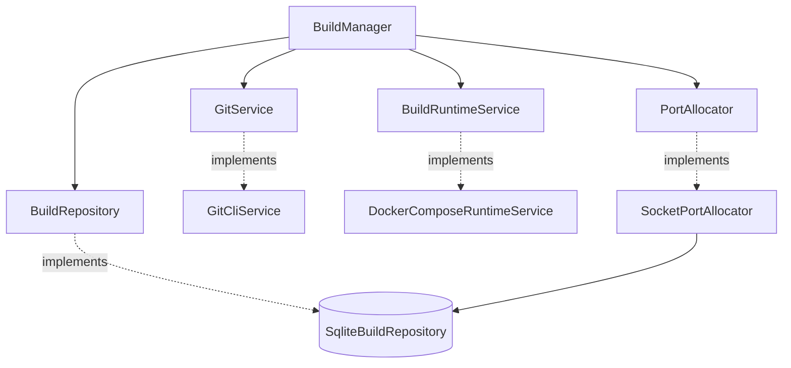

# Ports and adapters

The application depends on small protocols; `bootstrap.create_manager()` selects their concrete
implementations. This separation makes it possible to test lifecycle behavior without real Git or
Docker services.

## Git CLI

`GitCliService` accepts only aliases configured by the operator.

- Remotes: HTTPS, SSH, or `git@` syntax; HTTP, `file://`, and embedded credentials are rejected.
- Local sources: the path comes from configuration, never from an API or CLI request.
- Remotes are initialized and shallow-fetched; local sources are cloned without checkout.
- The ref resolves to a commit and the checkout remains detached.
- The target and `addons_subpath` must stay inside the workspace.

## Docker Compose

The adapter renders the packaged `mini_runbot/templates/compose.yaml.j2` template, validates it,
and executes stages with process argument lists rather than shell-built commands.

Each build receives its own project, network, database, PostgreSQL volume, filestore, and port.
Repositories are mounted read-only, and the preview is published only on `127.0.0.1`.

Current Odoo container limits are fixed at 2 GiB, 2 CPUs, 512 PIDs, and Docker log rotation of
10 MiB × 3. Making them configurable remains on the roadmap.

`inspect()` handles both JSON arrays and newline-delimited JSON from different Compose versions and
requires the `db` and `odoo` services to be running.

## SQLite

`SqliteBuildRepository` stores two tables:

| Table | Content |
| --- | --- |
| `builds` | Metadata, state, timings, resources, revisions, modules, stages, and version. |
| `port_leases` | Unique port-to-build ownership. |

Revisions and stages are serialized as JSON. Writes use optimistic version control. The schema is
still created through SQLAlchemy with one inline migration for `stages`; versioned migrations are
the next step before extending states or events.

## Ports

`SocketPortAllocator` scans the configured range. For each candidate it checks the real socket and
then acquires the SQLite lease transactionally. The in-memory map prevents collisions within one
process; the table prevents collisions across processes.

## Local test implementation

`LocalRuntimeService` prepares and destroys workspaces without Docker. It tests orchestration and
path safety; it does not represent a real Odoo execution.

## Related code

- [Service contracts](https://github.com/rafnixg/odoo-platform-ephemeral-environment/blob/master/src/mini_runbot/ports/services.py)
- [Persistence contracts](https://github.com/rafnixg/odoo-platform-ephemeral-environment/blob/master/src/mini_runbot/ports/repositories.py)
- [Bootstrap](https://github.com/rafnixg/odoo-platform-ephemeral-environment/blob/master/src/mini_runbot/bootstrap.py)
- [Compose template](https://github.com/rafnixg/odoo-platform-ephemeral-environment/blob/master/src/mini_runbot/templates/compose.yaml.j2)
