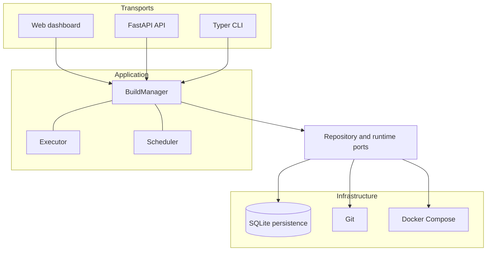

# Architecture

Mini-Runbot separates the domain from transport and infrastructure details.

## Layers

- `domain`: models, enums, validations, errors, and the state machine. It does not depend on
  FastAPI, Typer, SQLAlchemy, Git, or Docker.
- `application`: `BuildManager` orchestrates the lifecycle; the executor limits concurrency and the
  scheduler triggers periodic cleanup.
- `ports`: contracts that decouple persistence, checkout, and runtime.
- `adapters`: SQLite, Git CLI, port allocation, and Docker Compose implementations.
- `api` and `cli`: transports over the same use cases.
- `web`: static dashboard served directly by FastAPI.

## Build data flow

1. The transport validates input and `BuildManager` persists a `NEW` build.
2. Git resolves every ref to a SHA and creates a detached checkout inside the workspace.
3. Repositories are sorted by priority and an isolated Compose file is rendered.
4. `docker compose config` validates the file before any resource is created.
5. Install, test, start, and healthcheck run as separate stages.
6. Every result, including failures, is persisted immediately.

The API uses a bounded thread pool and returns before the build completes. The CLI with `--run`
executes the same pipeline synchronously.

## Isolation and persistence

Each build has its own workspace, Compose project name, network, PostgreSQL database and volume,
Odoo filestore, and loopback port. SQLite stores builds, revisions, stages, and port leases used to
coordinate local processes.

The executor is not a durable queue. After a controlled restart, `recover_interrupted()` classifies
active states as failed, reconciles runtimes and leases, and retries pending destruction.

## Portability

The application flow is identical on Windows and Linux. Paths use `pathlib.Path`, processes are
invoked with argument lists without depending on a shell, and the runtime uses `docker compose`.
Only virtual-environment activation, environment-variable assignment, and some administration
commands differ; both PowerShell and Bash variants are documented.

See the [architecture decisions](decisions/0001-phase-0-architecture.md) for accepted context and
consequences.
