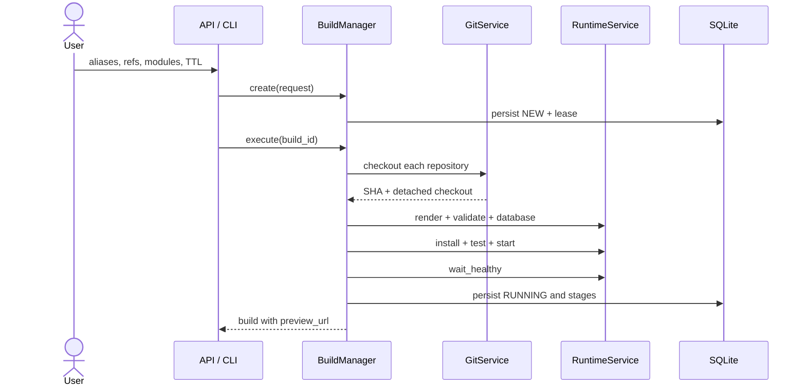

# Build pipeline

`BuildManager` applies the same use case whether a request comes from the API, CLI, or dashboard.
The API hands work to the local executor; the CLI with `--run` waits for the result.

## Creation and reservation

Before running containers, `create()`:

1. Validates aliases, refs, modules, and TTL.
2. Generates a unique ID, workspace, Compose name, and database name.
3. Maps each alias to an operator-configured source.
4. Reserves a loopback port with a persistent lease.
5. Persists the build as `NEW` and prepares `logs/` and `runtime/`.

If preparation fails, the port is released and evidence is retained with
`failure_stage: prepare_workspace`.

## Eight stages

| Stage | State | Action | Evidence |
| --- | --- | --- | --- |
| `checkout` | `CHECKING_OUT` | Resolves refs to SHAs and creates detached checkouts. | `checkout.log` and stored revisions. |
| `render` | `PREPARING` | Renders isolated Compose configuration. | `render.log`. |
| `compose_validate` | `PREPARING` | Runs `docker compose config --quiet`. | Log, output, and exit code. |
| `database` | `PREPARING` | Starts PostgreSQL and waits for its healthcheck. | Compose log. |
| `install` | `INSTALLING` | Installs modules with `--stop-after-init`. | Complete Odoo output. |
| `test` | `TESTING` | Runs tests tagged for the modules. | Odoo test output. |
| `start` | `STARTING` | Starts the persistent Odoo service. | Compose log. |
| `healthcheck` | `STARTING` | Waits for a valid HTTP response. | HTTP status or timeout. |

## Persistence and failures

Every successful stage is appended and persisted immediately. If an operation fails:

1. a `FAILED` stage records the available message, duration, code, and log;
2. `failure_stage`, `failure_message`, and `finished_at` are completed;
3. the build transitions to `FAILED`;
4. the runtime is destroyed and the port released unless `retain_failed_runtime` is enabled.

A cleanup failure is appended to the original message; it never replaces the initial cause.
Reaching `RUNNING` requires successful installation, tests, startup, and healthcheck. Started
containers alone are not sufficient.

## Reproducibility

Requested refs are mutable inputs, but the build stores their resolved SHAs. Repositories are
ordered by `(addons_priority, alias)` and mounted read-only, making the tested code and precedence
auditable.

## Related code

- [BuildManager](https://github.com/rafnixg/odoo-platform-ephemeral-environment/blob/master/src/mini_runbot/application/build_manager.py)
- [Compose runtime](https://github.com/rafnixg/odoo-platform-ephemeral-environment/blob/master/src/mini_runbot/adapters/runtime/compose.py)
- [Git checkout](https://github.com/rafnixg/odoo-platform-ephemeral-environment/blob/master/src/mini_runbot/adapters/git/cli.py)
- [Pipeline tests](https://github.com/rafnixg/odoo-platform-ephemeral-environment/blob/master/tests/unit/test_pipeline.py)
