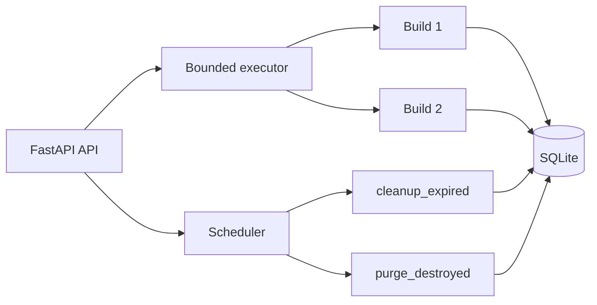

# Concurrency, cleanup, and recovery

Mini-Runbot coordinates several builds on one host, but it does not implement a durable queue. The
database retains lifecycle state; executor jobs live inside the API process.

## Executor and scheduler

`LocalBuildExecutor` uses a `ThreadPoolExecutor` bounded by `max_concurrent_builds`. It avoids
submitting the same build twice inside one process, but queued work is lost if that process exits.

`CleanupScheduler` is a daemon thread in the API process. It only starts when
`cleanup_interval_seconds > 0` and periodically runs expired cleanup and retention purging. It is
not a durable external scheduler.



## Persistent coordination

- SQLite uses optimistic locking with `Build.version`; a stale write raises
  `ConcurrentUpdateError`.
- `port_leases` enforces exclusive port-to-build ownership across processes.
- The allocator first performs a real bind on `127.0.0.1`, then acquires the transactional lease.
- `reconcile()` removes orphaned or inconsistent leases and recreates missing ones.

## Expiration and retention

`cleanup_expired()` examines builds whose `expires_at` has elapsed. A `RUNNING` build first becomes
`EXPIRED`; every expired, non-destroyed build then moves through `DESTROYING` to `DESTROYED`.

`destroyed_retention_seconds: 0` retains audit data and workspaces indefinitely. A positive value
allows `purge_destroyed()` to remove old records and directories, but only when the resolved
workspace exactly matches `<builds_root>/<build_id>`.

## Recovery after restart

Recovery is explicit, not automatic:

```console
mini-runbot recover
```

Stop any previous API process first. The operation:

- retries builds left in `DESTROYING`;
- marks interrupted execution states `FAILED` with stage `recovery`;
- inspects `RUNNING` builds and preserves those that remain healthy;
- fails and cleans missing or incomplete `RUNNING` runtimes;
- reconciles leases when finished.

With `retain_failed_runtime: true`, failed Docker evidence remains until manual destruction. The
command is repeatable, but it does not coordinate two orchestrators running simultaneously.

## Current limits

- Running commands cannot be cooperatively cancelled.
- Futures do not survive restart.
- The scheduler belongs to one API instance.
- SQLite coordinates persistence and ports, not distributed execution.

These limits are tracked in the [roadmap](roadmap.md).

## Related code

- [Executor](https://github.com/rafnixg/odoo-platform-ephemeral-environment/blob/master/src/mini_runbot/application/executor.py)
- [Scheduler](https://github.com/rafnixg/odoo-platform-ephemeral-environment/blob/master/src/mini_runbot/application/scheduler.py)
- [SQLite persistence](https://github.com/rafnixg/odoo-platform-ephemeral-environment/blob/master/src/mini_runbot/adapters/persistence/sqlite.py)
- [Port allocation](https://github.com/rafnixg/odoo-platform-ephemeral-environment/blob/master/src/mini_runbot/adapters/runtime/ports.py)
