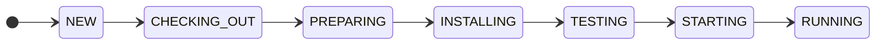

# ADR 0001: phase 0 architecture and execution strategy

- Status: accepted for phase 0
- Date: 2026-09-19

## Context

The repository started empty. The goal was to validate the lifecycle before all Odoo repositories,
images, modules, and dependencies needed for real execution were available.

## Decision

The first increment uses a framework-independent domain, narrow repository and runtime ports,
SQLite through SQLAlchemy, and application services shared by Typer and FastAPI.

The state machine is explicit:

Any active state may fail. Any non-destroyed state may transition through `DESTROYING` to
`DESTROYED`, and repeated destruction succeeds. `RUNNING` may expire before destruction.

## Git strategy

Only configured aliases are accepted. Every ref is resolved to a SHA before creating a detached
checkout under `<builds_root>/<build_id>/sources/<target>`. User working trees are never modified.
Origin, ref, SHA, target, and priority are persisted.

## Docker Compose strategy

A Jinja template is rendered only with validated or generated values. Every build receives its own
Compose project, network, PostgreSQL volume, database, workspace, filestore, and port. The file must
pass `docker compose config` before resources are created.

Install, test, and startup are separate invocations. `RUNNING` requires successful commands and a
valid HTTP healthcheck. Destruction runs `down --volumes --remove-orphans` for the validated project
and is safe to retry.

## Consequences

The domain and application can be tested without Docker and adapters can change without modifying
CLI/API lifecycle rules. Isolation reduces collisions but does not make hostile repositories safe.
