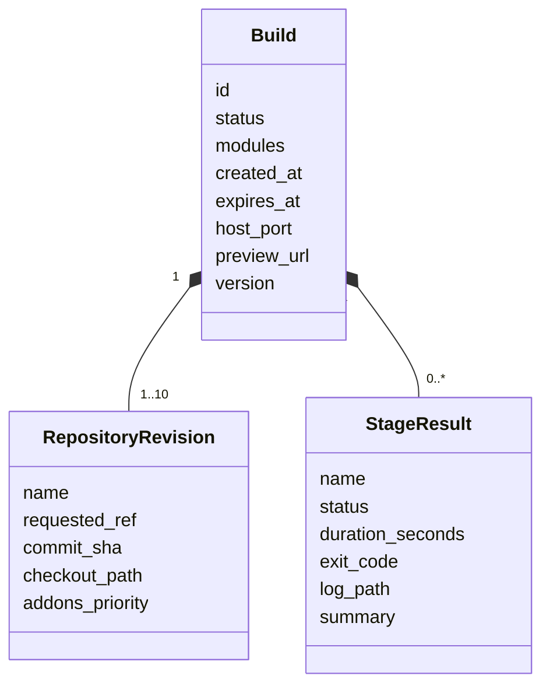
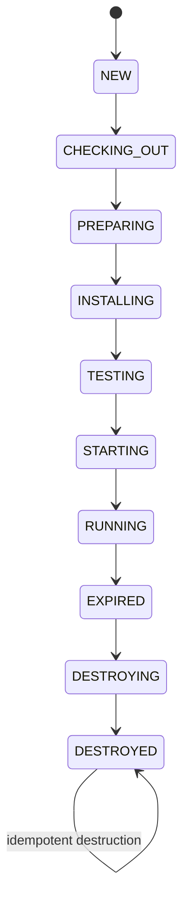

# Domain model

The domain describes a build without depending on FastAPI, Typer, SQLAlchemy, Git, or Docker. Its
types are the shared contract used by the API, CLI, dashboard, and adapters.

## Entities

| Entity | Responsibility |
| --- | --- |
| `Build` | Identity, lifecycle, timings, isolated resources, modules, revisions, and results. |
| `RepositoryRevision` | Allowed alias, requested ref, resolved SHA, checkout, and addon priority. |
| `StageResult` | Immutable stage result with timing, exit code, log, and summary. |
| `CleanupResult` | Builds examined, destroyed, and failed during cleanup or recovery. |
| `PurgeResult` | Audits and workspaces examined, purged, and failed during retention. |

`Build.version` provides optimistic locking: an update succeeds only when the stored version
matches the version read by the process.

## States and transitions

`NEW`, execution states, and `RUNNING` may transition to `FAILED`. Every state except `DESTROYING`
and `DESTROYED` may transition to `DESTROYING`. A transition outside these rules raises
`InvalidTransitionError`.

Stage results use `PENDING`, `RUNNING`, `SUCCESS`, `FAILED`, and `SKIPPED`. The current pipeline
mainly persists final `SUCCESS` or `FAILED` results; the other values leave room for future
evolution.

## Boundary validation

| Input | Main rule |
| --- | --- |
| Alias | Starts with a lowercase letter; only lowercase letters, digits, `_`, and `-`. |
| Git ref | At most 200 characters; rejects `..`, `//`, `@{`, `\`, controls, and unsafe prefixes. |
| Module | Lowercase letters, digits, and `_`; at most 128 characters and no duplicates. |
| Repositories | Between 1 and 10, with no duplicate aliases. |
| Modules | Between 1 and 100. |
| TTL | Between 300 and 604,800 seconds. |

Pydantic rejects extra fields. The legacy `repository` + `ref` selection remains supported, but it
cannot be mixed with `repositories`.

## Domain errors

All controlled errors derive from `MiniRunbotError`. Categories distinguish missing resources,
invalid transitions, concurrency conflicts, unsafe paths, configuration, Git, and runtime errors.
`RuntimeOperationError` can carry an `exit_code` and `log_path`; the manager copies them into the
failed result without exposing arbitrary paths to clients.

## Related code

- [Models](https://github.com/rafnixg/odoo-platform-ephemeral-environment/blob/master/src/mini_runbot/domain/models.py)
- [Statuses](https://github.com/rafnixg/odoo-platform-ephemeral-environment/blob/master/src/mini_runbot/domain/enums.py)
- [Transitions](https://github.com/rafnixg/odoo-platform-ephemeral-environment/blob/master/src/mini_runbot/domain/transitions.py)
- [Validation](https://github.com/rafnixg/odoo-platform-ephemeral-environment/blob/master/src/mini_runbot/domain/validation.py)
- [Errors](https://github.com/rafnixg/odoo-platform-ephemeral-environment/blob/master/src/mini_runbot/domain/errors.py)
