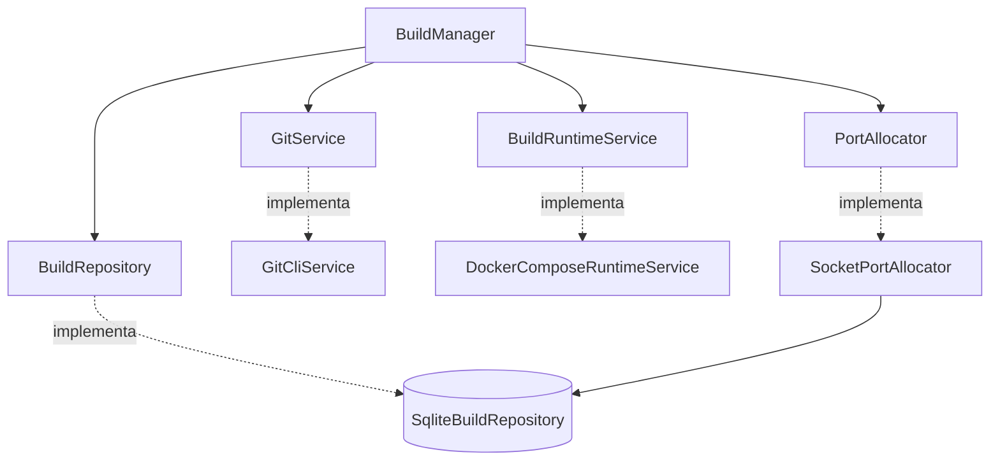

# Puertos y adaptadores

La aplicación depende de protocolos pequeños; `bootstrap.create_manager()` selecciona sus
implementaciones concretas. Esta separación permite probar el lifecycle sin Git o Docker reales.

## Git CLI

`GitCliService` acepta exclusivamente los alias configurados por el operador.

- Remotos: HTTPS, SSH o sintaxis `git@`; rechaza HTTP, `file://` y credenciales embebidas.
- Locales: la ruta procede de configuración, nunca de la solicitud API/CLI.
- Remotos se inicializan y descargan con fetch superficial; locales se clonan sin checkout.
- La ref se resuelve a commit y el checkout queda detached.
- El destino y `addons_subpath` deben permanecer dentro del workspace.

## Docker Compose

El adaptador renderiza la plantilla empaquetada `mini_runbot/templates/compose.yaml.j2`, valida el
resultado y ejecuta las etapas con
argumentos de proceso, sin construir comandos mediante un shell.

Cada build obtiene proyecto, red, base de datos, volumen PostgreSQL, filestore y puerto propios.
Los repositorios se montan como solo lectura. El preview solo se publica en `127.0.0.1`.

Los límites actuales del contenedor Odoo son fijos: 2 GiB, 2 CPU, 512 PIDs y rotación de logs
Docker de 10 MiB × 3. Hacerlos configurables permanece en el roadmap.

`inspect()` admite tanto un array JSON como objetos JSON por línea de distintas versiones de
Compose y exige los servicios `db` y `odoo` en ejecución.

## SQLite

`SqliteBuildRepository` persiste dos tablas:

| Tabla | Contenido |
| --- | --- |
| `builds` | Metadata, estado, tiempos, recursos, revisiones, módulos, etapas y versión. |
| `port_leases` | Relación única entre puerto y build. |

Revisiones y etapas se serializan como JSON. Las escrituras usan control optimista de versión. El
esquema aún se crea con SQLAlchemy y una migración puntual para `stages`; migraciones versionadas
son el siguiente paso antes de ampliar estados o eventos.

## Puertos

`SocketPortAllocator` recorre el rango configurado. Para cada candidato comprueba el socket real y
adquiere el lease SQLite dentro de una transacción. El mapa en memoria evita colisiones dentro del
proceso; la tabla evita colisiones entre procesos.

## Implementación local de pruebas

`LocalRuntimeService` prepara y destruye workspaces sin Docker. Se usa para probar orquestación y
seguridad de rutas; no representa una ejecución Odoo real.

## Código relacionado

- [Contratos de servicios](https://github.com/rafnixg/odoo-platform-ephemeral-environment/blob/master/src/mini_runbot/ports/services.py)
- [Contratos de persistencia](https://github.com/rafnixg/odoo-platform-ephemeral-environment/blob/master/src/mini_runbot/ports/repositories.py)
- [Bootstrap](https://github.com/rafnixg/odoo-platform-ephemeral-environment/blob/master/src/mini_runbot/bootstrap.py)
- [Plantilla Compose](https://github.com/rafnixg/odoo-platform-ephemeral-environment/blob/master/src/mini_runbot/templates/compose.yaml.j2)
