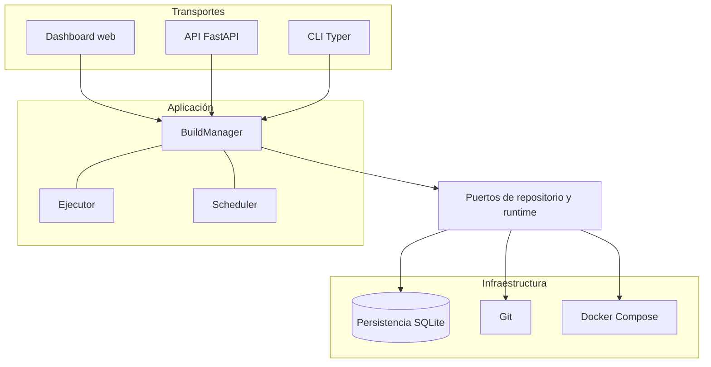

# Arquitectura

Mini-Runbot separa el dominio de los detalles de transporte e infraestructura.

## Capas

- `domain`: modelos, enums, validaciones, errores y máquina de estados. No depende de FastAPI,
  Typer, SQLAlchemy, Git ni Docker.
- `application`: `BuildManager` orquesta el lifecycle; el ejecutor limita concurrencia y el
  scheduler activa limpieza periódica.
- `ports`: contratos que desacoplan persistencia, checkout y runtime.
- `adapters`: implementaciones SQLite, Git CLI, asignación de puertos y Docker Compose.
- `api` y `cli`: transportes sobre los mismos casos de uso.
- `web`: dashboard estático servido directamente por FastAPI.

## Flujo de un build

1. El transporte valida el payload y `BuildManager` persiste un build `NEW`.
2. Git resuelve cada ref a un SHA y crea un checkout detached dentro del workspace.
3. Se ordenan repositorios por prioridad y se renderiza un Compose aislado.
4. `docker compose config` valida el archivo antes de crear recursos.
5. Se ejecutan instalación, pruebas, arranque y healthcheck como etapas independientes.
6. Cada resultado se persiste inmediatamente, incluido cualquier fallo.

La API usa un pool de threads acotado y responde antes de completar el build. La CLI con `--run`
ejecuta el mismo pipeline de forma síncrona.

## Aislamiento y persistencia

Cada build tiene workspace, nombre de proyecto Compose, red, base PostgreSQL, volumen PostgreSQL,
filestore Odoo y puerto loopback propios. SQLite conserva builds, revisiones, etapas y leases de
puertos para coordinar procesos locales.

El ejecutor no es una cola durable. Tras un reinicio controlado, `recover_interrupted()` clasifica
estados activos como fallidos, reconcilia runtime y leases, y reintenta destrucciones pendientes.

## Portabilidad

El flujo de aplicación es el mismo en Windows y Linux. Las rutas se gestionan con `pathlib.Path`,
los procesos se invocan con listas de argumentos sin depender de un shell y el runtime usa
`docker compose`. Solo cambian la activación del entorno virtual, la asignación de variables de
entorno y algunos comandos de administración documentados para PowerShell y Bash.

Consulte las [decisiones arquitectónicas](decisions/0001-phase-0-architecture.md) para conocer el
contexto y las consecuencias aceptadas.
