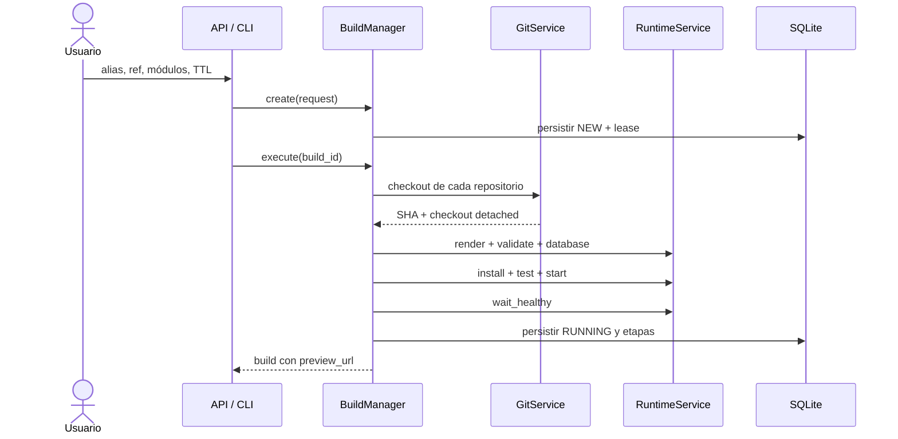

# Pipeline de construcción

`BuildManager` aplica el mismo caso de uso tanto si la solicitud llega desde la API, la CLI o el
dashboard. La API entrega el trabajo al ejecutor local; la CLI con `--run` espera el resultado.

## Creación y reserva

Antes de ejecutar contenedores, `create()`:

1. Valida alias, refs, módulos y TTL.
2. Genera un ID, workspace, nombre Compose y base de datos únicos.
3. Traduce cada alias a un origen configurado por el operador.
4. Reserva un puerto loopback con lease persistente.
5. Persiste el build como `NEW` y prepara `logs/` y `runtime/`.

Si la preparación falla, el puerto se libera y se conserva evidencia con
`failure_stage: prepare_workspace`.

## Ocho etapas

| Etapa | Estado | Acción | Evidencia |
| --- | --- | --- | --- |
| `checkout` | `CHECKING_OUT` | Resuelve refs a SHA y crea checkouts detached. | `checkout.log` y revisiones persistidas. |
| `render` | `PREPARING` | Renderiza el Compose aislado. | `render.log`. |
| `compose_validate` | `PREPARING` | Ejecuta `docker compose config --quiet`. | Log, salida y código. |
| `database` | `PREPARING` | Inicia PostgreSQL y espera su healthcheck. | Log de Compose. |
| `install` | `INSTALLING` | Instala módulos con `--stop-after-init`. | Salida completa de Odoo. |
| `test` | `TESTING` | Ejecuta tests etiquetados para los módulos. | Salida de pruebas Odoo. |
| `start` | `STARTING` | Inicia el servicio Odoo persistente. | Log de Compose. |
| `healthcheck` | `STARTING` | Espera una respuesta HTTP válida. | Estado HTTP o timeout. |

## Persistencia y fallos

Cada etapa exitosa se añade y persiste inmediatamente. Si una operación falla:

1. se registra una etapa `FAILED` con mensaje, duración, código y log disponibles;
2. se completan `failure_stage`, `failure_message` y `finished_at`;
3. el build pasa a `FAILED`;
4. el runtime se destruye y el puerto se libera, salvo que `retain_failed_runtime` esté activo.

Un fallo del cleanup se añade al mensaje original: nunca reemplaza la causa inicial. Alcanzar
`RUNNING` exige instalación, tests, arranque y healthcheck exitosos; contenedores iniciados no son
suficientes.

## Reproducibilidad

Las refs solicitadas son entradas mutables, pero el build conserva los SHAs resueltos. Los
repositorios se ordenan por `(addons_priority, alias)` y se montan como solo lectura. Esto hace
auditable qué código y qué precedencia se probaron.

## Código relacionado

- [BuildManager](https://github.com/rafnixg/odoo-platform-ephemeral-environment/blob/master/src/mini_runbot/application/build_manager.py)
- [Runtime Compose](https://github.com/rafnixg/odoo-platform-ephemeral-environment/blob/master/src/mini_runbot/adapters/runtime/compose.py)
- [Checkout Git](https://github.com/rafnixg/odoo-platform-ephemeral-environment/blob/master/src/mini_runbot/adapters/git/cli.py)
- [Pruebas del pipeline](https://github.com/rafnixg/odoo-platform-ephemeral-environment/blob/master/tests/unit/test_pipeline.py)
