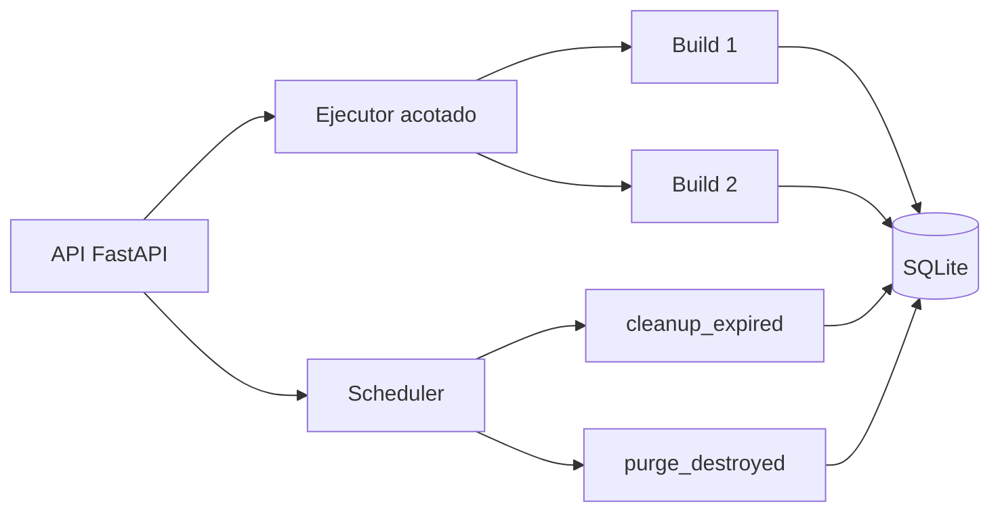

# Concurrencia, cleanup y recuperación

Mini-Runbot coordina varios builds en un solo host, pero no implementa una cola durable. La base de
datos conserva el lifecycle; los trabajos del ejecutor viven en el proceso de la API.

## Ejecutor y scheduler

`LocalBuildExecutor` usa un `ThreadPoolExecutor` limitado por `max_concurrent_builds`. Evita enviar
dos veces el mismo build dentro de un proceso, pero una tarea pendiente se pierde si ese proceso
termina.

`CleanupScheduler` es un thread daemon del proceso API. Solo se activa cuando
`cleanup_interval_seconds > 0` y ejecuta periódicamente cleanup de expirados y purga por retención.
No sustituye una tarea durable externa.



## Coordinación persistente

- SQLite usa optimistic locking con `Build.version`; una escritura con versión antigua produce
  `ConcurrentUpdateError`.
- `port_leases` impone exclusividad entre puerto y build incluso entre procesos distintos.
- El asignador comprueba primero un bind real en `127.0.0.1` y después adquiere el lease
  transaccional.
- `reconcile()` elimina leases huérfanos o inconsistentes y reconstruye los que falten.

## Expiración y retención

`cleanup_expired()` examina builds cuyo `expires_at` venció. Un build `RUNNING` pasa primero por
`EXPIRED`; luego cualquier build vencido no destruido pasa por `DESTROYING` a `DESTROYED`.

`destroyed_retention_seconds: 0` conserva indefinidamente auditoría y workspace. Un valor positivo
permite que `purge_destroyed()` elimine registros y directorios antiguos, pero solo cuando el
workspace resuelto coincide exactamente con `<builds_root>/<build_id>`.

## Recuperación tras reinicio

La recuperación es explícita, no automática:

```console
mini-runbot recover
```

Detenga primero cualquier proceso API anterior. La operación:

- reintenta builds detenidos en `DESTROYING`;
- marca estados de ejecución interrumpidos como `FAILED` con etapa `recovery`;
- inspecciona builds `RUNNING` y conserva los que siguen saludables;
- falla y limpia runtimes `RUNNING` ausentes o incompletos;
- reconcilia los leases al finalizar.

Con `retain_failed_runtime: true`, la evidencia Docker fallida se mantiene hasta una destrucción
manual. El comando puede repetirse, pero no coordina dos orquestadores ejecutándose simultáneamente.

## Límites actuales

- No hay cancelación cooperativa de comandos en ejecución.
- Los futures no sobreviven a un reinicio.
- El scheduler pertenece a una sola instancia de API.
- SQLite coordina persistencia y puertos, no distribuye ejecución.

Estas limitaciones están registradas en el [roadmap](roadmap.md).

## Código relacionado

- [Ejecutor](https://github.com/rafnixg/odoo-platform-ephemeral-environment/blob/master/src/mini_runbot/application/executor.py)
- [Scheduler](https://github.com/rafnixg/odoo-platform-ephemeral-environment/blob/master/src/mini_runbot/application/scheduler.py)
- [Persistencia SQLite](https://github.com/rafnixg/odoo-platform-ephemeral-environment/blob/master/src/mini_runbot/adapters/persistence/sqlite.py)
- [Asignación de puertos](https://github.com/rafnixg/odoo-platform-ephemeral-environment/blob/master/src/mini_runbot/adapters/runtime/ports.py)
