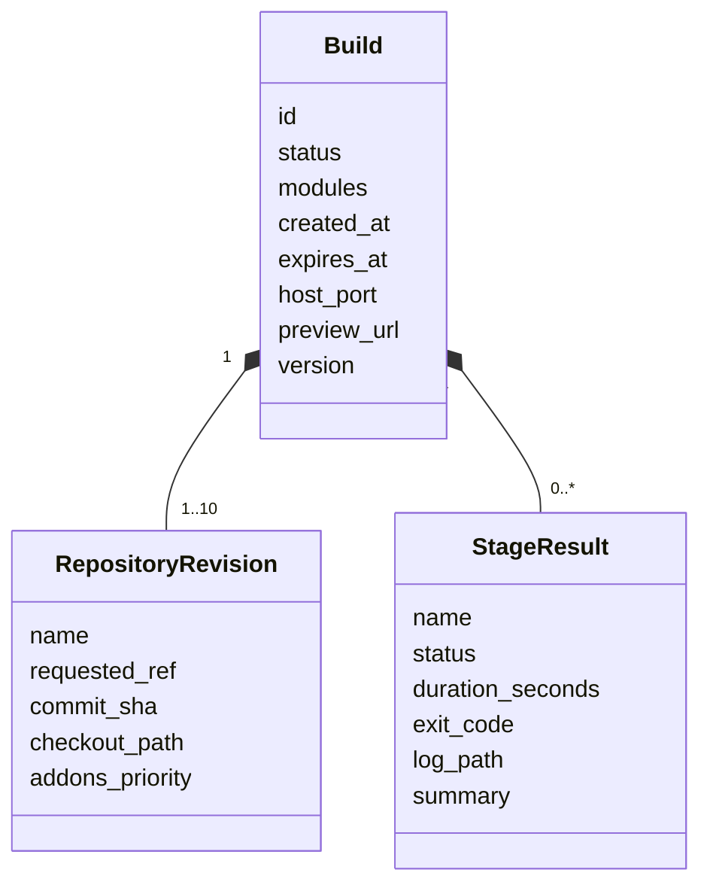
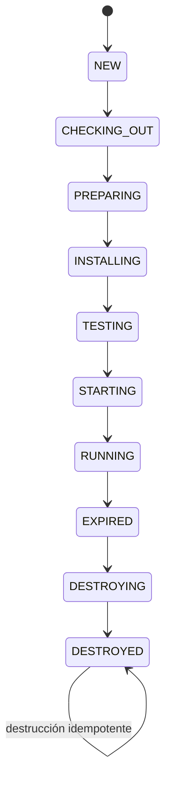

# Modelo de dominio

El dominio describe un build sin depender de FastAPI, Typer, SQLAlchemy, Git ni Docker. Sus tipos
son el contrato compartido por la API, la CLI, el dashboard y los adaptadores.

## Entidades

| Entidad | Responsabilidad |
| --- | --- |
| `Build` | Identidad, lifecycle, tiempos, recursos aislados, módulos, revisiones y resultados. |
| `RepositoryRevision` | Alias autorizado, ref solicitada, SHA resuelto, checkout y prioridad de addons. |
| `StageResult` | Resultado inmutable de una etapa con tiempo, código de salida, log y resumen. |
| `CleanupResult` | Builds examinados, destruidos y fallidos durante cleanup o recuperación. |
| `PurgeResult` | Auditorías y workspaces examinados, purgados y fallidos por retención. |

`Build.version` implementa optimistic locking: una actualización solo se acepta si la versión
persistida coincide con la que leyó el proceso.

## Estados y transiciones

`NEW`, los estados de ejecución y `RUNNING` pueden pasar a `FAILED`. Cualquier estado salvo
`DESTROYING` y `DESTROYED` puede pasar a `DESTROYING`. Una transición fuera de estas reglas genera
`InvalidTransitionError`.

Los resultados de etapa usan `PENDING`, `RUNNING`, `SUCCESS`, `FAILED` y `SKIPPED`. El pipeline
actual persiste principalmente resultados finales `SUCCESS` o `FAILED`; los otros valores forman
parte del contrato para evolución futura.

## Validación en la frontera

| Entrada | Regla principal |
| --- | --- |
| Alias | Empieza por letra minúscula y solo admite minúsculas, números, `_` y `-`. |
| Ref Git | Máximo 200 caracteres; rechaza `..`, `//`, `@{`, `\`, controles y prefijos peligrosos. |
| Módulo | Minúsculas, números y `_`; máximo 128 caracteres y sin duplicados. |
| Repositorios | Entre 1 y 10, sin alias repetidos. |
| Módulos | Entre 1 y 100. |
| TTL | Entre 300 y 604 800 segundos. |

Pydantic rechaza campos adicionales. La selección antigua `repository` + `ref` sigue admitida,
pero no puede mezclarse con `repositories`.

## Errores del dominio

Todos los errores controlados heredan de `MiniRunbotError`. Las categorías distinguen recursos no
encontrados, transiciones inválidas, conflictos concurrentes, rutas inseguras, configuración, Git y
runtime. `RuntimeOperationError` puede transportar `exit_code` y `log_path`; el manager los copia al
resultado fallido sin revelar rutas arbitrarias al cliente.

## Código relacionado

- [Modelos](https://github.com/rafnixg/odoo-platform-ephemeral-environment/blob/master/src/mini_runbot/domain/models.py)
- [Estados](https://github.com/rafnixg/odoo-platform-ephemeral-environment/blob/master/src/mini_runbot/domain/enums.py)
- [Transiciones](https://github.com/rafnixg/odoo-platform-ephemeral-environment/blob/master/src/mini_runbot/domain/transitions.py)
- [Validación](https://github.com/rafnixg/odoo-platform-ephemeral-environment/blob/master/src/mini_runbot/domain/validation.py)
- [Errores](https://github.com/rafnixg/odoo-platform-ephemeral-environment/blob/master/src/mini_runbot/domain/errors.py)
