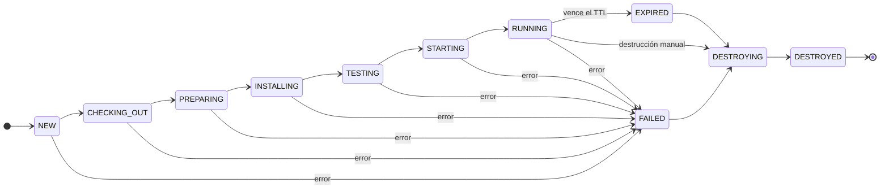

# Mini-Runbot para Odoo 16

Mini-Runbot convierte revisiones Git autorizadas y una lista de módulos en un entorno Odoo 16
aislado, probado y temporal. Está diseñado como una prueba de concepto de un solo host para código
de confianza.

## Qué resuelve

- Resuelve referencias Git a commits inmutables y crea checkouts separados.
- Combina hasta diez repositorios configurados con prioridad de addons determinista.
- Instala módulos, ejecuta sus pruebas, inicia Odoo y comprueba el preview HTTP.
- Conserva estados, duraciones, revisiones, errores y logs en SQLite.
- Expone el mismo ciclo de vida mediante dashboard, API FastAPI y CLI Typer.
- Aísla cada build con su propio proyecto Compose, red, base de datos, volúmenes y puerto.
- Se instala y opera tanto en Windows con PowerShell como en Linux con Bash.

## Flujo principal

Un build solo llega a `RUNNING` cuando los módulos fueron instalados, las pruebas terminaron sin
fallos, el servidor arrancó y el healthcheck devolvió una respuesta válida.

## Siguiente paso

[Instalar Mini-Runbot](getting-started.md){ .md-button .md-button--primary }
[Entender la arquitectura](architecture.md){ .md-button }

!!! warning "Límite de seguridad"
    Docker y la validación de entradas reducen accidentes, pero Mini-Runbot no es una frontera de
    seguridad para ejecutar código hostil. Use únicamente repositorios de confianza configurados
    por el operador.
